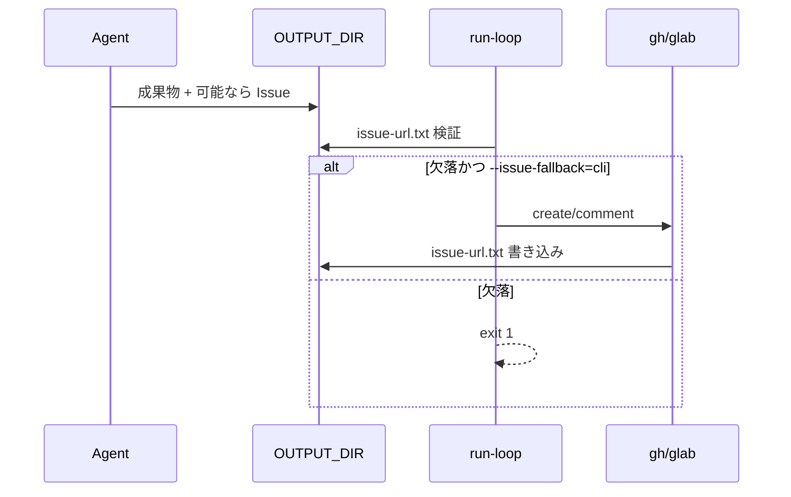

# Issue 投稿

| 項目 | 値 |
| --- | --- |
| ステータス | `done`（P0-2 ゲート + CLI フォールバック実装済み） |
| 関連実装 | `engine/run-loop.sh`（`ISSUE_POST_INSTRUCTIONS`）, MCP via `opencode_mcp_servers.py`, 各 `loops/*/prompt.md` |
| ロードマップ | P0-2 |

## 現状

### できること

- `issue_post_mode: create | update`
- create: 毎回新規 Issue、URL を `issue-url.txt` に保存するようプロンプト指示
- update: 既存 Issue へコメント追記
- GitHub remote MCP / GitLab local MCP（トークンは環境変数）

### ギャップ

| 問題 | 影響 |
| --- | --- |
| 投稿はエージェント遵守依存 | MCP 失敗・拒否でも promise が出うる |
| `permission.mcp_* = ask` | 無人実行で投稿が止まる（→ permissions 文書） |
| doctor の「gh/glab 代替」 | **CLI フォールバック実装なし** |
| ホスト側検証なし | `issue-url.txt` 未作成でもループ「成功」扱い |

## 要件定義（P0-2）

### FR-ISSUE-1 完了ゲート

ループ定義または target が Issue 投稿を要求する場合、Ralph 終了後にホストが次を検証すること。

- `{{OUTPUT_DIR}}/issue-url.txt` が存在し、非空で URL らしいこと
- 満たさない場合: 非ゼロ終了、または明確な WARN + 推奨アクション（実装方針は設定で選択可。**既定は非ゼロ推奨**）

### FR-ISSUE-2 CLI フォールバック

エージェントが Issue を作れなかった場合に備え、ホスト側ヘルパーを提供すること。

例:

```bash
engine/lib/issue.sh create --provider github --repo-url ... --title ... --body-file ...
engine/lib/issue.sh comment --provider github --issue ... --body-file ...
```

- GitHub: `gh`
- GitLab: `glab`
- 成功時に `issue-url.txt` を書く

### FR-ISSUE-3 プロンプト整合

`ISSUE_POST_INSTRUCTIONS` に「失敗時は issue-url.txt を書かない」「ホストが検証する」旨を追記し、嘘の完了を減らす。

### FR-ISSUE-4（任意・同一 RUN）

create モードで既存 `issue-url.txt` がある場合は新規作成せず追記（現状プロンプト指示済み）。ホストヘルパーも同じ規則に従う。

### 非機能

- トークンをリポジトリに書かない
- dry-run では Issue を作らない

## 設計

### 完了ゲート挿入点

`run-loop.sh` で Ralph 成功リターン後:

```
if loop_requires_issue; then
  verify_issue_url_file "$output_dir/issue-url.txt" || exit 1
fi
```

`loop_requires_issue` は:

- 既定: 全同梱ループで true（現状すべて Issue を完了条件に含む）
- 将来: `loop.yaml` に `require_issue: true|false`

### フォールバックフロー



### doctor との関係

[doctor-and-setup.md](./doctor-and-setup.md): `GITHUB_TOKEN` / `GITLAB_TOKEN` / `gh` / `glab` の有無を WARN。

## 受け入れ条件

- [ ] Issue 未作成のまま exit 0 にならない（ゲート有効時）
- [ ] `gh` があれば MCP なしでも issue-url.txt を作れる（フォールバック有効時）
- [ ] update モードで誤って新規 Issue を大量生産しない
- [ ] dry-run で Issue API を呼ばない
