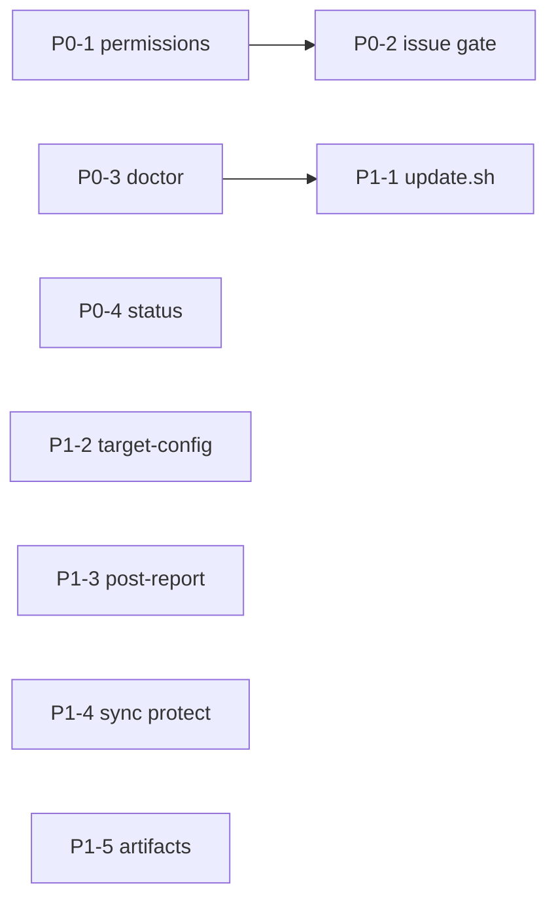

# ロードマップ

調査日: 2026-08-11  
対象: loop-engineering（OpenCode + Ralph + ECC、ローカル LLM）

## 現状サマリ

ポータブルな「隣置き基盤」の骨格と、P0–P2 の運用ギャップはおおむね埋まっている。

- setup → sync-ecc（マルチループ和集合）→ init → run-loop → 対象内成果物 → Marp/動画
- ワークスペース境界（`.loop-engineering/`）、`--status`、`update.sh`、Issue 完了ゲート、permission プロファイル、doctor（同梱ループ一覧）、smoke CI、成果物 list/clean、`security-audit` / `deps-audit` ループ

P0–P4 のロードマップ項目は完了。以降は需要ベース拡張。詳細は下の **P3 / Remaining** と **P4**。

## 優先度定義

| 優先度 | 基準 |
| --- | --- |
| P0 | 移植して無人ループを回すときに止まる／嘘の完了になる |
| P1 | 運用摩擦が大きいが回避可能 |
| P2 | 品質・拡張・DX |
| P3 | 任意・後回し（動くがまだ薄い／需要待ち） |
| P4 | P3 後の薄い運用ギャップ（smoke / doctor 発見性など） |

## P0（完了）

| ID | 機能 | 文書 | 状態 |
| --- | --- | --- | --- |
| P0-1 | 無人実行向け permission プロファイル | [permissions-unattended.md](./permissions-unattended.md) | **done** |
| P0-2 | Issue 完了ゲート + CLI フォールバック | [issue-posting.md](./issue-posting.md) | **done** |
| P0-3 | doctor「接続完了」診断 | [doctor-and-setup.md](./doctor-and-setup.md) | **done** |
| P0-4 | `run-loop.sh --status` | [loop-runner.md](./loop-runner.md) | **done** |

## P1（完了）

| ID | 機能 | 文書 | 状態 |
| --- | --- | --- | --- |
| P1-1 | `setup/update.sh` ワンショット更新 | [porting-and-update.md](./porting-and-update.md) | **done** |
| P1-2 | init の `--target-config` 対応 | [target-config.md](./target-config.md) | **done** |
| P1-3 | レポート/動画のポスト処理オプション | [report-video-pipeline.md](./report-video-pipeline.md) | **done** |
| P1-4 | sync 時のカスタム保護 + マルチループ和集合 | [ecc-sync.md](./ecc-sync.md) | **done** |
| P1-5 | 成果物ライフサイクル（list/clean） | [artifact-lifecycle.md](./artifact-lifecycle.md) | **done** |

## P2（完了）

| ID | 機能 | メモ |
| --- | --- | --- |
| P2-1 | エンジン smoke テスト / CI | **done** — `./tests/smoke.sh` / `.github/workflows/smoke.yml` |
| P2-2 | Linux 既定 TTS 自動選択 | **done** — `say` 不在時 `voicevox`/`none` |
| P2-3 | Marp バージョン固定の推奨明示 | **done** — doctor / docs |
| P2-4 | ターゲットレジストリ `targets/*.yaml` | **done** — [target-config.md](./target-config.md) |
| P2-5 | 未使用 `engine/opencode/opencode.json.tmpl` 整理 | **done** — 参考として保持 |
| P2-6 | 追加ループ製品化 | **done** — [`security-audit`](../../loops/security-audit/) |

## P3 / Remaining

実装済みの骨格に対する、真に残っている任意項目。

| ID | 項目 | メモ |
| --- | --- | --- |
| P3-1 | 細粒度 MCP permission | **done** — サーバ別 `mcp_permission_overrides` → `permission.<server>_*`（ツール単位 DSL は未対応。[permissions-unattended.md](./permissions-unattended.md) FR-PERM-4） |
| P3-2 | `deps-audit` 専用ループ | **done** — [`loops/deps-audit/`](../../loops/deps-audit/)。outdated・audit CLI・lockfile衛生に特化（[bundled-loops.md](./bundled-loops.md)） |
| P3-3 | report.md → Marp e2e 受け入れの厚み | **done** — fixture + stub npx で pin/`report.md`→pdf+slides/欠落スキップを smoke 固定。実 Chromium・TTS・フル動画は CI 外（[report-video-pipeline.md](./report-video-pipeline.md)） |
| P3-4 | 同梱ループのシード改善 | **done** — `ensure_seed_files`（型別スタブ・不正パス拒否・非上書き）+ smoke + [bundled-loops.md](./bundled-loops.md) |

**P3 完了**（2026-08-11）。ロードマップ上の P3 項目はすべて done。

**完了済み（参照用）**: マルチループ ECC sync（`--loop` × N / `--all-loops` / `update.sh` 経由の和集合）— [ecc-sync.md](./ecc-sync.md)

## P4（P3 後の薄いギャップ）

P3 完了後に残る、発明ではなく既知の回帰・発見性ギャップ。

| ID | 項目 | メモ |
| --- | --- | --- |
| P4-1 | `--all-loops` の smoke 固定 | **done** — 列挙に `deps-audit` を含み `_template` を除外、和集合スキルが揃うことを `./tests/smoke.sh` で検証（[ecc-sync.md](./ecc-sync.md)） |
| P4-2 | 成果物 list/clean の smoke | **done** — 偽 RUN ツリーで `list-runs`（latest `*`）/ `clean-runs --dry-run` / `--keep N` を `./tests/smoke.sh` で固定（[artifact-lifecycle.md](./artifact-lifecycle.md)） |
| P4-3 | doctor の同梱ループ一覧 | **done** — `doctor.sh` が `loops/*/loop.yaml` を列挙（`_template` 除外）。`./tests/smoke.sh` で既知ループを固定（[doctor-and-setup.md](./doctor-and-setup.md)） |
| P4-4 | doctor 未 init 受け入れの smoke | **done** — 未 init target（`.opencode/opencode.json` 不在）で ERROR + 非ゼロを `./tests/smoke.sh` で固定（[doctor-and-setup.md](./doctor-and-setup.md)） |

**P4 完了**（2026-08-11）。ロードマップ上の P4 項目はすべて done。

**非目標（据え置き）**: ツール単位 MCP DSL、CI での実 Chromium/TTS/フル動画 e2e、需要のない新規製品ループ。

## 推奨実装順（履歴）

P0–P4 は完了。それ以外の拡張は需要ベース（新ループは `_template` / `new-loop.sh`）。

## 完了の定義（マイルストーン）

### M1: Unattended Ready

- [x] ループを対話なしで完走できる permission プロファイルがある
- [x] Issue 未投稿のまま promise で「完了」にならない
- [x] `doctor` が target / init / token 不足を WARN/ERROR で出す
- [x] `--status` が動く

### M2: Ops Ready

- [x] `update.sh` で pull→sync→init→doctor が一発
- [x] init と run-loop が同じ target-config 解決規則
- [x] エージェントが Marp を飛ばしても `--post-report` で救済可能
- [x] カスタム rules が sync で不意に消えない
- [x] 複数ループの ECC 和集合 sync（`--loop` × N / `--all-loops`）

### M3: Quality

- [x] smoke CI（`./tests/smoke.sh` / `.github/workflows/smoke.yml`）
- [x] 成果物の list/clean（`list-runs` / `clean-runs`）
- [x] TTS / Marp の環境差が doctor で案内される
- [x] 未使用 `engine/opencode/opencode.json.tmpl` の整理（参考 README）
- [x] ターゲットレジストリ（`--target-name` / `targets/*.yaml`）
- [x] 追加ループ製品化（`security-audit` / `deps-audit`）
