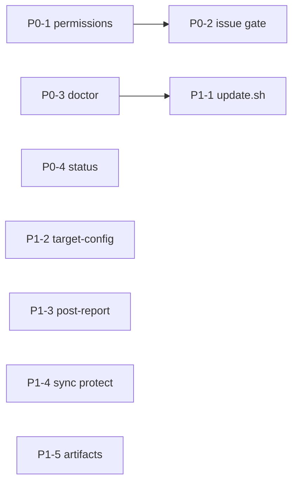

# ロードマップ

調査日: 2026-08-11  
対象: loop-engineering（OpenCode + Ralph + ECC、ローカル LLM）

## 現状サマリ

ポータブルな「隣置き基盤」の骨格は揃っている。

- setup → sync-ecc → init → run-loop → 対象内成果物 → Marp/動画（エージェント呼出）
- ワークスペース境界対策（`.loop-engineering/`）は実装済み

主なギャップは **無人実行の信頼性**（MCP permission / Issue 完了ゲート）、**doctor の深さ**、**更新・マルチターゲットの一貫性**、**ドキュメントと CLI の乖離**。

## 優先度定義

| 優先度 | 基準 |
| --- | --- |
| P0 | 移植して無人ループを回すときに止まる／嘘の完了になる |
| P1 | 運用摩擦が大きいが回避可能 |
| P2 | 品質・拡張・DX |

## P0

| ID | 機能 | 文書 | 依存 |
| --- | --- | --- | --- |
| P0-1 | 無人実行向け permission プロファイル | [permissions-unattended.md](./permissions-unattended.md) | — |
| P0-2 | Issue 完了ゲート + CLI フォールバック | [issue-posting.md](./issue-posting.md) | P0-1 推奨 |
| P0-3 | doctor「接続完了」診断 | [doctor-and-setup.md](./doctor-and-setup.md) | — |
| P0-4 | `run-loop.sh --status` 実装または文書削除 | [loop-runner.md](./loop-runner.md) | — |

## P1

| ID | 機能 | 文書 | 依存 |
| --- | --- | --- | --- |
| P1-1 | `setup/update.sh` ワンショット更新 | [porting-and-update.md](./porting-and-update.md) | P0-3 推奨 |
| P1-2 | init の `--target-config` 対応 | [target-config.md](./target-config.md) | — |
| P1-3 | レポート/動画のポスト処理オプション | [report-video-pipeline.md](./report-video-pipeline.md) | — |
| P1-4 | sync 時のカスタム保護 | [ecc-sync.md](./ecc-sync.md) | — |
| P1-5 | 成果物ライフサイクル（list/clean） | [artifact-lifecycle.md](./artifact-lifecycle.md) | — |

## P2

| ID | 機能 | メモ |
| --- | --- | --- |
| P2-1 | エンジン smoke テスト / CI | render-prompt、dry-run、yaml_get |
| P2-2 | Linux 既定 TTS 自動選択 | `say` 不在時 `none`/`voicevox` |
| P2-3 | Marp バージョン固定の推奨明示 | doctor / docs |
| P2-4 | ターゲットレジストリ `targets/*.yaml` | [target-config.md](./target-config.md) **done** |
| P2-5 | 未使用 `engine/opencode/opencode.json.tmpl` 整理 | **done** — 参考として保持、[engine/opencode/README.md](../../engine/opencode/README.md) で未使用と明記 |
| P2-6 | 追加ループ製品化 | セキュリティ監査等（枠は `_template` 済み） |

## 推奨実装順

1. P0-1 → P0-2（無人 Issue 投稿を通す）
2. P0-3 / P0-4（診断と CLI 約束の整合）並行可
3. P1-1 / P1-2（運用・マルチターゲット）
4. P1-3〜P1-5、その後 P2

## 完了の定義（マイルストーン）

### M1: Unattended Ready

- [x] ループを対話なしで完走できる permission プロファイルがある
- [x] Issue 未投稿のまま promise で「完了」にならない
- [x] `doctor` が target / init / token 不足を WARN/ERROR で出す
- [x] `--status` が動くか、文書から消えている

### M2: Ops Ready

- [x] `update.sh` で pull→sync→init→doctor が一発
- [x] init と run-loop が同じ target-config 解決規則
- [x] エージェントが Marp を飛ばしても `--post-report` で救済可能
- [x] カスタム rules が sync で不意に消えない

### M3: Quality

- [x] smoke CI（`./tests/smoke.sh` / `.github/workflows/smoke.yml`）
- [x] 成果物の list/clean（`list-runs` / `clean-runs`）
- [x] TTS / Marp の環境差が doctor で案内される
- [x] 未使用 `engine/opencode/opencode.json.tmpl` の整理（参考 README）
- [x] ターゲットレジストリ（`--target-name` / `targets/*.yaml`）
